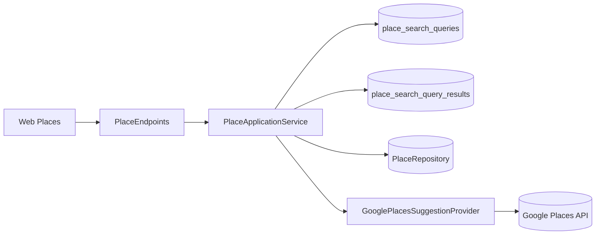

# Document tecnic (CA)

## 1. Introduccio

Aquest document descriu com esta construida **Zuppeto** a nivell tecnic.
En l'estat actual, el projecte es una web Angular 21 connectada a un backend `.NET`, arquitectura per `features`
i una primera base funcional de mapa amb `Leaflet` i `OpenStreetMap`.

Objectius:

- documentar l'arquitectura actual del frontend
- deixar traçabilitat de components, serveis i decisions tecniques
- explicar el model de dades actual
- descriure la base d'autenticacio real i control d'acces
- descriure la implementacio del mapa
- deixar traçabilitat del domini backend que obre la Fase III
- deixar una base UML tecnica clara i mantenible
- documentar la infraestructura de missatgeria (`RabbitMQ`) quan quedi preparada al repositori

## 2. Esquema tecnic general

<pre style="background:#020617; color:#e5eef7; border:1px solid #1e293b; border-radius:16px; padding:20px; margin:16px 0; overflow:auto; line-height:1.65;"><code><span style="color:#5eead4; font-weight:700;">flowchart LR</span>
  <span style="color:#93c5fd;">U[Usuari]</span> --&gt;|<span style="color:#fcd34d;">Navegador</span>| <span style="color:#c4b5fd;">W[Zuppeto Web Angular]</span>
  <span style="color:#c4b5fd;">W</span> --&gt;|<span style="color:#fca5a5;">HTTP real</span>| <span style="color:#86efac;">API[(Zuppeto Api)]</span>
  <span style="color:#c4b5fd;">W</span> --&gt;|<span style="color:#fcd34d;">Mapa</span>| <span style="color:#67e8f9;">MAP[Leaflet + OpenStreetMap]</span>

  <span style="color:#5eead4; font-weight:700;">subgraph</span> <span style="color:#f9a8d4;">FE[Frontend Angular]</span>
    <span style="color:#93c5fd;">C[core]</span>
    <span style="color:#93c5fd;">S[shared]</span>
    <span style="color:#93c5fd;">F[features]</span>
  <span style="color:#5eead4; font-weight:700;">end</span>

  <span style="color:#c4b5fd;">W</span> --&gt; <span style="color:#93c5fd;">F</span>
  <span style="color:#93c5fd;">F</span> --&gt; <span style="color:#93c5fd;">C</span>
  <span style="color:#93c5fd;">F</span> --&gt; <span style="color:#93c5fd;">S</span>
  <span style="color:#93c5fd;">F</span> --&gt; <span style="color:#86efac;">API</span>
  <span style="color:#93c5fd;">F</span> --&gt; <span style="color:#67e8f9;">MAP</span></code></pre>

Resum del diagrama:

- la web Angular es el punt d'entrada de l'usuari
- la logica es distribueix per `features`
- `core` conté peces globals i `shared` peces reutilitzables
- els fluxos principals del frontend ja treballen contra API real
- el mapa es tracta com una capacitat transversal reutilitzable

## 2.1 Estat tecnic actual

En aquest moment conviuen dues capes amb rols diferents:

- un frontend Angular 21 que continua sent la base executable del producte
- un backend `.NET` complet a `Domain`, `Application`, `Infrastructure` i `Api`, ja integrat amb la web per als fluxos principals

Aixo vol dir que:

- la UI ja consumeix backend real per `places`, `favorites`, manteniment de `perfil` i autenticació
- la persistencia real ja esta implementada
- el login propi ja passa per `Api` i la federacio Google ja queda disponible en `Development`
- pero el model de domini ja no depen del model fake del frontend
- el backend comenca pel domini i no per la base de dades
- el domini continua separat de la persistencia ORM encara que `Entity Framework` ja estigui muntat a `Infrastructure`

## 2.2 Base backend oberta a Fase III

La Fase III s'ha obert amb una primera capa `Domain` a:

```text
src/Backend/Domain
```

Peces creades:

- `Domain.csproj`
- base comuna `Entity`, `AggregateRoot`, `ValueObject` i `DomainRuleException`
- agregats `Place`, `User`, `FavoriteList`, `PlaceReview`
- `value objects` per adreca, geolocalitzacio, politica pet, preu, rating, perfil i consentiment
- contractes de repositori com a abstraccions
- solucio `__Zuppeto_sln__` per carregar el backend al workspace i a l'editor

Decisio tecnica clau:

- el domini s'ha començat abans que `PostgreSQL`, `Entity Framework` o API
- la persistencia s'ha d'adaptar al domini
- el frontend actual segueix sent referència funcional, pero no dicta la forma final de persistencia

## 2.3 Base de dades de desenvolupament

Per poder treballar el model relacional sense dependre d'una instal·lacio manual local, el repo incorpora ja una base de dades de desenvolupament amb `Docker`.

Peces creades:

- `docker-compose.yml`
- `.env.example`
- carpeta `sql/init/` reservada per bootstrap mínim no governat per ORM
- port extern `5433` per conviure amb altres stacks locals que ja usen `5432`
- fitxers `sql/init/*` reduits a suport de bootstrap i no a creacio de schema

<pre style="background:#020617; color:#e5eef7; border:1px solid #1e293b; border-radius:16px; padding:20px; margin:16px 0; overflow:auto; line-height:1.65;"><code><span style="color:#5eead4; font-weight:700;">flowchart LR</span>
  <span style="color:#93c5fd;">DEV[Desenvolupament local]</span> --&gt; <span style="color:#c4b5fd;">DC[docker-compose.yml]</span>
  <span style="color:#c4b5fd;">DC</span> --&gt; <span style="color:#86efac;">PG[(PostgreSQL 17 :5433 extern)]</span>
  <span style="color:#c4b5fd;">DC</span> --&gt; <span style="color:#fcd34d;">ENV[Variables .env]</span>
  <span style="color:#86efac;">PG</span> --&gt; <span style="color:#f9a8d4;">SQL[sql/init]</span>
  <span style="color:#f9a8d4;">SQL</span> --&gt; <span style="color:#a7f3d0;">SCH[Schema real creat]</span></code></pre>

Resum del diagrama:

- el desenvolupament local arrenca la BBDD a traves de `docker-compose`
- la configuracio sensible queda externalitzada a variables d'entorn
- `sql/init` queda reservada per bootstrap auxiliar i no per crear l'esquema principal
- la BBDD es un suport operatiu del punt actual, no el centre de l'arquitectura
- el port `5433` evita conflictes amb altres repos locals que ja fan servir `5432`
- la validacio del contenidor confirma que la base de dades local de `Zuppeto` ja esta operativa
- l'esquema real ja queda governat per migracions d'`Entity Framework`

## 2.4 Persistencia ORM en Infrastructure

La implementacio base d'`Entity Framework` ja queda consolidada a `src/Backend/Infrastructure` sense contaminar el domini.

Peces creades:

- `DependencyInjection.cs`
- `Persistence/__ZuppetoDbContext__.cs`
- `Persistence/__ZuppetoDbContext__Factory.cs`
- `Persistence/Entities/*`
- `Persistence/Configurations/*`
- `Persistence/Migrations/*`
- `dotnet-tools.json` per fixar `dotnet-ef` 10 al repo

Decisio tecnica clau:

- no es mapegen directament els agregats de domini a EF
- `Infrastructure` manté models de persistencia propis
- el domini continua net de dependències ORM
- la creacio d'esquema es governa per migracions EF i no per SQL manual
- el mapping domini <-> persistencia queda reservat per al punt de mapatges i repositoris
- aquest mapping es fara manualment i per agregat, sense `AutoMapper`

<pre style="background:#020617; color:#e5eef7; border:1px solid #1e293b; border-radius:16px; padding:20px; margin:16px 0; overflow:auto; line-height:1.65;"><code><span style="color:#5eead4; font-weight:700;">flowchart LR</span>
  <span style="color:#93c5fd;">DOM[Domain]</span> -.-> <span style="color:#c4b5fd;">APP[Application]</span>
  <span style="color:#c4b5fd;">APP</span> -.-> <span style="color:#86efac;">INF[Infrastructure]</span>
  <span style="color:#86efac;">INF</span> --&gt; <span style="color:#fcd34d;">CTX[__ZuppetoDbContext__]</span>
  <span style="color:#fcd34d;">CTX</span> --&gt; <span style="color:#f9a8d4;">CFG[EF Configurations]</span>
  <span style="color:#fcd34d;">CTX</span> --&gt; <span style="color:#67e8f9;">REC[Persistence Records]</span>
  <span style="color:#fcd34d;">CTX</span> --&gt; <span style="color:#a7f3d0;">PG[(PostgreSQL :5433)]</span>
  <span style="color:#fcd34d;">CTX</span> --&gt; <span style="color:#fde68a;">MIG[EF Migrations]</span>
  <span style="color:#86efac;">INF</span> -.-> <span style="color:#fca5a5;">MAP[Manual Aggregate Mappers]</span></code></pre>

Resum del diagrama:

- `Entity Framework` queda encapsulat dins de `Infrastructure`
- `DbContext`, configuracions i records de persistencia viuen fora del domini
- les migracions passen a ser la font de veritat de l'esquema
- l'arquitectura continua coherent amb `DDD` i evita acoblar negoci i ORM
- el següent tram ja no és muntar EF, sinó mapar domini i implementar repositoris
- el mapatge serà manual per agregat per mantenir control explícit sobre `value objects`, col·leccions i regles de conversió

## 2.5 Estrategia de mapatge i repositoris

Per al punt actiu, el backend treballara amb aquesta estrategia:

- un mapper manual per agregat
- mappers ubicats a `Infrastructure/Persistence/Mappings`
- repositoris EF a `Infrastructure/Persistence/Repositories`
- cada repositori utilitza `__ZuppetoDbContext__` + mapper del seu agregat
- el domini no coneix ni EF ni els records de persistencia

Distribucio prevista:

- `PlacePersistenceMapper`
- `UserPersistenceMapper`
- `FavoriteListPersistenceMapper`
- `PlaceReviewPersistenceMapper`

<pre style="background:#020617; color:#e5eef7; border:1px solid #1e293b; border-radius:16px; padding:20px; margin:16px 0; overflow:auto; line-height:1.65;"><code><span style="color:#5eead4; font-weight:700;">flowchart LR</span>
  <span style="color:#93c5fd;">REP[EF Repository]</span> --&gt; <span style="color:#c4b5fd;">CTX[__ZuppetoDbContext__]</span>
  <span style="color:#93c5fd;">REP</span> --&gt; <span style="color:#86efac;">MAP[Aggregate Mapper]</span>
  <span style="color:#86efac;">MAP</span> --&gt; <span style="color:#fcd34d;">DOM[Aggregate Domain]</span>
  <span style="color:#86efac;">MAP</span> --&gt; <span style="color:#f9a8d4;">REC[Persistence Record]</span>
  <span style="color:#c4b5fd;">CTX</span> --&gt; <span style="color:#67e8f9;">DB[(PostgreSQL)]</span></code></pre>

Resum del diagrama:

- el repositori EF coordina lectura i escriptura
- el mapper transforma entre agregat de domini i model de persistencia
- la conversio es explícita i no amagada en eines automàtiques
- aquesta via facilita mantenir `DDD` i controlar millor l'evolucio dels `value objects`

## 2.6 Estat tancat de mapatge i repositoris

Aquest punt ja queda completat dins de `Infrastructure`.

Peces creades:

- `Persistence/Mappings/PlacePersistenceMapper.cs`
- `Persistence/Mappings/UserPersistenceMapper.cs`
- `Persistence/Mappings/FavoriteListPersistenceMapper.cs`
- `Persistence/Mappings/PlaceReviewPersistenceMapper.cs`
- `Persistence/Repositories/PlaceRepository.cs`
- `Persistence/Repositories/UserRepository.cs`
- `Persistence/Repositories/FavoriteListRepository.cs`
- `Persistence/Repositories/PlaceReviewRepository.cs`

<pre style="background:#020617; color:#e5eef7; border:1px solid #1e293b; border-radius:16px; padding:20px; margin:16px 0; overflow:auto; line-height:1.65;"><code><span style="color:#5eead4; font-weight:700;">flowchart LR</span>
  <span style="color:#93c5fd;">IPlaceRepository</span> --&gt; <span style="color:#c4b5fd;">PlaceRepository</span>
  <span style="color:#93c5fd;">IUserRepository</span> --&gt; <span style="color:#c4b5fd;">UserRepository</span>
  <span style="color:#93c5fd;">IFavoriteListRepository</span> --&gt; <span style="color:#c4b5fd;">FavoriteListRepository</span>
  <span style="color:#93c5fd;">IPlaceReviewRepository</span> --&gt; <span style="color:#c4b5fd;">PlaceReviewRepository</span>
  <span style="color:#c4b5fd;">PlaceRepository</span> --&gt; <span style="color:#86efac;">PlacePersistenceMapper</span>
  <span style="color:#c4b5fd;">UserRepository</span> --&gt; <span style="color:#86efac;">UserPersistenceMapper</span>
  <span style="color:#c4b5fd;">FavoriteListRepository</span> --&gt; <span style="color:#86efac;">FavoriteListPersistenceMapper</span>
  <span style="color:#c4b5fd;">PlaceReviewRepository</span> --&gt; <span style="color:#86efac;">PlaceReviewPersistenceMapper</span>
  <span style="color:#c4b5fd;">PlaceRepository</span> --&gt; <span style="color:#fcd34d;">__ZuppetoDbContext__</span>
  <span style="color:#c4b5fd;">UserRepository</span> --&gt; <span style="color:#fcd34d;">__ZuppetoDbContext__</span>
  <span style="color:#c4b5fd;">FavoriteListRepository</span> --&gt; <span style="color:#fcd34d;">__ZuppetoDbContext__</span>
  <span style="color:#c4b5fd;">PlaceReviewRepository</span> --&gt; <span style="color:#fcd34d;">__ZuppetoDbContext__</span></code></pre>

Resum del diagrama:

- cada contracte de domini ja te una implementacio EF concreta
- cada repositori depen del seu mapper i del `DbContext`
- el punt queda tancat sense trencar la separacio entre domini i infraestructura
- el següent pas ja és pujar de nivell cap al backend `.NET` i els casos d'ús

## 2.7 Estat tancat del backend `.NET`

El backend `.NET` ja queda estructurat amb les quatre capes base:

- `Domain`
- `Application`
- `Infrastructure`
- `Api`

Peces creades a `Application`:

- `DependencyInjection.cs`
- serveis d'aplicacio per `places`, `favorites`, `users` i `reviews`
- DTOs/contractes d'entrada i sortida

<pre style="background:#020617; color:#e5eef7; border:1px solid #1e293b; border-radius:16px; padding:20px; margin:16px 0; overflow:auto; line-height:1.65;"><code><span style="color:#5eead4; font-weight:700;">flowchart LR</span>
  <span style="color:#93c5fd;">API[Api]</span> --&gt; <span style="color:#c4b5fd;">APP[Application]</span>
  <span style="color:#c4b5fd;">APP</span> --&gt; <span style="color:#86efac;">DOM[Domain]</span>
  <span style="color:#c4b5fd;">APP</span> --&gt; <span style="color:#fcd34d;">ABS[Repository Abstractions]</span>
  <span style="color:#fcd34d;">ABS</span> --&gt; <span style="color:#f9a8d4;">INF[Infrastructure]</span>
  <span style="color:#f9a8d4;">INF</span> --&gt; <span style="color:#67e8f9;">DB[(PostgreSQL)]</span></code></pre>

Resum del diagrama:

- `Application` ja coordina el negoci entre domini i persistencia
- `Api` encara és mínima, però ja pot consumir serveis d'aplicacio
- el backend deixa de ser només infraestructura i passa a tenir capa d'ús real
- el següent pas natural és exposar aquests serveis com a API HTTP

## 2.8 Estat tancat del punt d'API

El punt d'API ja queda tancat amb:

- `minimal APIs` a la capa `Api`
- `Swagger` actiu per inspeccio i prova manual d'endpoints
- grups de rutes per `places`, `favorites`, `users` i `reviews`
- endpoints HTTP recolzats només en serveis d'`Application`
- sense accedir directament a `DbContext` des de `Api`
- validacio real contra `PostgreSQL`

<pre style="background:#020617; color:#e5eef7; border:1px solid #1e293b; border-radius:16px; padding:20px; margin:16px 0; overflow:auto; line-height:1.65;"><code><span style="color:#5eead4; font-weight:700;">flowchart LR</span>
  <span style="color:#93c5fd;">HTTP[HTTP Request]</span> --&gt; <span style="color:#c4b5fd;">API[Minimal API Endpoint]</span>
  <span style="color:#c4b5fd;">API</span> --&gt; <span style="color:#86efac;">APP[Application Service]</span>
  <span style="color:#86efac;">APP</span> --&gt; <span style="color:#fcd34d;">REPO[Repository Contract]</span>
  <span style="color:#fcd34d;">REPO</span> --&gt; <span style="color:#f9a8d4;">INF[EF Repository]</span>
  <span style="color:#f9a8d4;">INF</span> --&gt; <span style="color:#67e8f9;">DB[(PostgreSQL)]</span></code></pre>

Resum del diagrama:

- la capa `Api` no coneix la persistència
- cada endpoint delega en un servei d'aplicació
- la persistència queda encapsulada sota contractes i repositoris
- el flux HTTP ja s'ha validat de punta a punta amb dades persistides

Rutes reals validades:

- `GET /api/places`
- `GET /api/places/{id}`
- `GET /api/places/cities`
- `POST /api/places`
- `PUT /api/places/{id}`
- `GET /api/users/{id}`
- `GET /api/users/by-email/{email}`
- `POST /api/users`
- `PUT /api/users/{id}/profile`
- `GET /api/favorites/{ownerUserId}`
- `POST /api/favorites/{ownerUserId}/places/{placeId}`
- `DELETE /api/favorites/{ownerUserId}/places/{placeId}`
- `GET /api/reviews/places/{placeId}`
- `POST /api/reviews`
- `PUT /api/reviews/{id}`

Acces de documentacio navegable:

- `GET /swagger`

## 2.9 Estat tancat de la integracio frontend -> API

La Fase III queda tancada perquè el frontend ja consumeix la nova API en els fluxos principals.

Peces integrades:

- `PlaceService` carregant `places` des d'HTTP real
- `FavoritesService` persistint favorits contra backend
- `AuthService` sincronitzant usuaris locals amb l'endpoint de `users`
- `ProfilePage` guardant sobre backend real
- `Api` amb `CORS` habilitat per `http://localhost:4200`
- arrencada Docker de l'`Api` corregida perquè el `content root` sigui `src/Backend/Api` i carregui la configuració real de `Development`

<pre style="background:#020617; color:#e5eef7; border:1px solid #1e293b; border-radius:16px; padding:20px; margin:16px 0; overflow:auto; line-height:1.65;"><code><span style="color:#5eead4; font-weight:700;">flowchart LR</span>
  <span style="color:#93c5fd;">WEB[Angular Web]</span> --&gt; <span style="color:#c4b5fd;">PS[PlaceService HTTP]</span>
  <span style="color:#93c5fd;">WEB</span> --&gt; <span style="color:#86efac;">FS[FavoritesService HTTP]</span>
  <span style="color:#93c5fd;">WEB</span> --&gt; <span style="color:#fcd34d;">AS[AuthService + sync users]</span>
  <span style="color:#c4b5fd;">PS</span> --&gt; <span style="color:#f9a8d4;">API[Minimal API]</span>
  <span style="color:#86efac;">FS</span> --&gt; <span style="color:#f9a8d4;">API</span>
  <span style="color:#fcd34d;">AS</span> --&gt; <span style="color:#f9a8d4;">API</span>
  <span style="color:#f9a8d4;">API</span> --&gt; <span style="color:#67e8f9;">APP[Application]</span>
  <span style="color:#67e8f9;">APP</span> --&gt; <span style="color:#a7f3d0;">INF[Infrastructure]</span>
  <span style="color:#a7f3d0;">INF</span> --&gt; <span style="color:#fde68a;">DB[(PostgreSQL)]</span></code></pre>

Resum del diagrama:

- la web ja no depen del `PlaceSource` mock per al cataleg principal
- favorits i perfil ja escriuen sobre dades persistides
- el login es manté local però crea o recupera usuari real al backend
- la Fase III queda tancada i la Fase IV s'obre com a següent focus tècnic

## 2.10 Stack Docker local complet

Per mantenir el mateix criteri de treball que a `escoles-publiques`, `yeppet` ja disposa d'un stack Docker complet de desenvolupament.

Peces afegides:

- `docker-compose.yml` ampliat amb `db`, `api` i `web`
- `docker/api/Dockerfile.dev`
- `docker/web/Dockerfile.dev`
- `.dockerignore`
- `__ZuppetoDbContext__Factory` adaptat per llegir `__ConnectionStrings_Zuppeto__` també dins de contenidors

<pre style="background:#020617; color:#e5eef7; border:1px solid #1e293b; border-radius:16px; padding:20px; margin:16px 0; overflow:auto; line-height:1.65;"><code><span style="color:#5eead4; font-weight:700;">flowchart LR</span>
  <span style="color:#93c5fd;">DEV[Desenvolupament local]</span> --&gt; <span style="color:#c4b5fd;">DC[docker compose]</span>
  <span style="color:#c4b5fd;">DC</span> --&gt; <span style="color:#86efac;">WEB[Angular web :4200]</span>
  <span style="color:#c4b5fd;">DC</span> --&gt; <span style="color:#fcd34d;">API[.NET API :5211]</span>
  <span style="color:#c4b5fd;">DC</span> --&gt; <span style="color:#f9a8d4;">DB[(PostgreSQL :5433)]</span>
  <span style="color:#fcd34d;">API</span> --&gt; <span style="color:#f9a8d4;">DB</span>
  <span style="color:#86efac;">WEB</span> --&gt; <span style="color:#fcd34d;">API</span></code></pre>

Resum del diagrama:

- la BBDD, l'API i la web ja es poden aixecar en una sola ordre
- l'API aplica migracions d'`Entity Framework` a l'arrencada
- l'API s'executa des de la carpeta `src/Backend/Api`, evitant perdre `appsettings.Development.json` dins Docker
- la web Angular s'executa en mode desenvolupament dins de contenidor
- el flux local queda alineat amb el criteri operatiu usat a `escoles-publiques`

### 2.10.1 Perfils de Run and Debug a VS Code

Per replicar el patró operatiu d'`escoles-publiques`, `yeppet` incorpora ara configuració nativa de `VS Code` a `.vscode/launch.json` i `.vscode/tasks.json`.

Perfils disponibles:

- `Docker: Stack completa`
- `Docker: DB`
- `Docker: API (Attach)`
- `Docker: Swagger`
- `Docker: API + Swagger (Attach)`
- `Docker: Web (Debug)`
- `Docker: API + Web (Attach)`
- `Docker: Stack completa (Attach)`

Tasques disponibles:

- `docker up all`
- `docker up db`
- `docker up api`
- `docker up web`
- `docker down`
- `wait api ready`
- `wait web ready`
- `install vsdbg (api)`
- `api up + ready + vsdbg`
- `web up + ready`

Notes tècniques:

- `Docker: Stack completa (Attach)` tracta `db` com a servei dependent del stack, però els únics targets de depuració reals són `api` i `web`
- `Docker: API + Swagger (Attach)` és un `compound` que combina l'`attach` real de `.NET` amb l'obertura de `Swagger`
- el navegador continua sent `Brave` via `pwa-chrome`

<pre style="background:#020617; color:#e5eef7; border:1px solid #1e293b; border-radius:16px; padding:20px; margin:16px 0; overflow:auto; line-height:1.65;"><code><span style="color:#5eead4; font-weight:700;">flowchart LR</span>
  <span style="color:#93c5fd;">VS[VS Code Run and Debug]</span> --&gt; <span style="color:#c4b5fd;">LA[launch.json]</span>
  <span style="color:#c4b5fd;">LA</span> --&gt; <span style="color:#86efac;">TA[tasks.json]</span>
  <span style="color:#86efac;">TA</span> --&gt; <span style="color:#fcd34d;">DC[docker compose]</span>
  <span style="color:#fcd34d;">DC</span> --&gt; <span style="color:#f9a8d4;">DB[(db)]</span>
  <span style="color:#fcd34d;">DC</span> --&gt; <span style="color:#a7f3d0;">API[api + Swagger]</span>
  <span style="color:#fcd34d;">DC</span> --&gt; <span style="color:#67e8f9;">WEB[web Angular]</span></code></pre>

Resum del diagrama:

- `launch.json` combina `attach` real de `.NET` a `yeppet-api` i debug web amb Brave
- l'API es depura per `coreclr` + `vsdbg` dins del contenidor
- `tasks.json` encapsula les ordres `docker compose` per evitar passos manuals
- el workspace pot aixecar la stack completa o només el servei que toqui, esperant que els serveis quedin llestos abans de depurar

### 2.10.2 RabbitMQ (broker de missatges, infra preparada)

S'ha incorporat **RabbitMQ** com a servei de desenvolupament i com a **dependència opcional** del backend, sense cablejar encara cap cas d'ús de domini ni reemplaçar el publicador d'esdeveniments en memòria de `Application`.

**Motiu tècnic:** disposar d'un broker real per aprendre i per evolucionar cap a missatgeria asíncrona (cues, publicació/consum, patrons de fiabilitat) sense bloquejar l'arquitectura per capes.

**Peces afegides o tocades:**

- `docker-compose.yml`: servei `rabbitmq` (`rabbitmq:4-management`), volum persistent, healthcheck, ports `5672` (AMQP) i `15672` (UI de gestió); el servei `api` depèn de `rabbitmq` sa i rep `RabbitMq__HostName=rabbitmq` dins la xarxa Docker
- `src/Backend/Api/appsettings.json` i `appsettings.Development.json`: secció `RabbitMq` (`Enabled`, `HostName`, `Port`, `UserName`, `Password`, `VirtualHost`)
- `src/Backend/Infrastructure/Infrastructure.csproj`: paquets `RabbitMQ.Client` i `Microsoft.Extensions.Configuration.Binder`
- `src/Backend/Infrastructure/RabbitMq/RabbitMqOptions.cs`: enllaç amb la configuració
- `src/Backend/Infrastructure/RabbitMq/RabbitMqDependencyInjection.cs`: registre **condicional** de `RabbitMQ.Client.IConnection` només si `RabbitMq:Enabled` és `true`; nom de connexió client `ClientProvidedName = yeppet-api`
- `DependencyInjection.AddInfrastructure`: crida `AddRabbitMq(configuration)`

**Decisió tècnica clau:**

- amb `Enabled: false` (per defecte a `appsettings.json` base) **no** es registra `IConnection`; l'API pot coexistir sense broker
- amb `Enabled: true` (desenvolupament local típic) es crea una **connexió singleton** la primera vegada que algú resol `IConnection`; cap servei de l'API la demana encara, de manera que **no hi ha publicació ni consum real**
- el domini i `Application` **no** depenen de RabbitMQ; tot queda encapsulat a `Infrastructure`

**Documentació operativa del stack:** `docs/ca/docker-stack-ca.md`.

<pre style="background:#020617; color:#e5eef7; border:1px solid #1e293b; border-radius:16px; padding:20px; margin:16px 0; overflow:auto; line-height:1.65;"><code><span style="color:#5eead4; font-weight:700;">flowchart LR</span>
  <span style="color:#93c5fd;">API[Api .NET]</span> -.->|<span style="color:#94a3b8;">opcional</span>| <span style="color:#f472b6;">CONN[IConnection]</span>
  <span style="color:#f472b6;">CONN</span> -.->|<span style="color:#94a3b8;">AMQP :5672</span>| <span style="color:#86efac;">RMQ[(RabbitMQ)]</span>
  <span style="color:#93c5fd;">API</span> --&gt; <span style="color:#fcd34d;">INF[Infrastructure DI]</span>
  <span style="color:#fcd34d;">INF</span> --&gt; <span style="color:#c4b5fd;">CFG[appsettings RabbitMq]</span>
  <span style="color:#fcd34d;">INF</span> -.-> <span style="color:#f472b6;">CONN</span>
  <span style="color:#67e8f9;">DEV[Docker compose]</span> --&gt; <span style="color:#86efac;">RMQ</span></code></pre>

Resum del diagrama:

- la connexió és un detall d'`Infrastructure` governat per configuració
- el broker corre al compose de desenvolupament; l'API dins Docker usa el hostname `rabbitmq`
- les línies puntejades indiquen registre i ús **encara no** lligats a casos d'ús ni a canals (`IModel`)

<pre style="background:#020617; color:#e5eef7; border:1px solid #1e293b; border-radius:16px; padding:20px; margin:16px 0; overflow:auto; line-height:1.65;"><code><span style="color:#5eead4; font-weight:700;">flowchart TB</span>
  <span style="color:#93c5fd;">APP[Application]</span>
  <span style="color:#c4b5fd;">DOM[Domain]</span>
  <span style="color:#86efac;">INF[Infrastructure]</span>
  <span style="color:#f472b6;">MQ[RabbitMQ.Client]</span>
  <span style="color:#fcd34d;">RMQ[(RabbitMQ servidor)]</span>

  <span style="color:#93c5fd;">APP</span> --&gt; <span style="color:#c4b5fd;">DOM</span>
  <span style="color:#93c5fd;">APP</span> --&gt; <span style="color:#86efac;">INF</span>
  <span style="color:#c4b5fd;">DOM</span> -.-x <span style="color:#f472b6;">MQ</span>
  <span style="color:#86efac;">INF</span> --&gt; <span style="color:#f472b6;">MQ</span>
  <span style="color:#f472b6;">MQ</span> --&gt; <span style="color:#fcd34d;">RMQ</span></code></pre>

Resum del diagrama:

- el domini **no** referencia el client AMQP
- només `Infrastructure` pot obrir connexió cap al servidor; quan s'afegeixin publicadors o consumidors, han de viure en aquesta capa o en adaptadors cridats des de `Application` mitjançant interfícies pròpies, no des del domini

### 2.10.3 Build .NET a l'host i permisos a `obj-local` / `bin-local`

Quan l'`API` o altres processos s'executen dins de **Docker** amb volums muntats al codi del repositori, les carpetes de sortida de build (sovint `obj-local` i `bin-local` sota `src/Backend/**`) poden quedar creades amb un **uid/gid** que no coincideixen amb l'usuari de desenvolupament a la màquina host (p. ex. `nobody` / `root`).

Efecte típic: `dotnet build`, `dotnet restore` o `dotnet ef` fallen amb **“Permission denied”** en escriure a `obj`/`obj-local`.

Mesures habituals a l'entorn de desenvolupament:

- Ajustar **propietat** d'aquestes carpetes a l'usuari que compila a l'host, o
- **Eliminar-les** (quan sigui segur) abans d'un build net a l'host, o
- Fer `dotnet build` **només** dins del mateix entorn (contenidor) que les va generar, sense barrejar amb build a l'host sobre el mateix arbre de fitxers.

Això afecta sobretot la reproductibilitat d'`Entity Framework` i l'arrencada de l'API quan l'entrada aplica `database update` al iniciar: si el model no compila o la migració no s'aplica, el contenidor d'API pot sortir i la web (p. ex. després d'un F5) es queda sense backend.

## 3. Arquitectura aplicada

### 2.11 Obertura tècnica de Fase IV

Amb la Fase III tancada, el nou focus tècnic passa a ser la seguretat operativa del producte:

- autenticació real
- autenticació federada amb proveïdors externs
- rols i permisos
- diferenciació entre zones públiques i internes
- control d'accessos per funcionalitat
- primer increment tècnic: login propi backend amb emissió de token i federació Google ja cablejada en desenvolupament

La decisió de base per al model de rols queda fixada així:

- `VIEWER`: només lectura a producte i dades, sense operacions `insert`, `update` ni `delete`
- `VIEWER`: pot navegar per qualsevol zona funcional en mode lectura
- `VIEWER`: sense capacitat de marcar, desmarcar o persistir `favorites`
- `VIEWER`: sense capacitat d'actualitzar cap dada pròpia ni aliena
- `VIEWER`: només necessita nom d'usuari assignat; el perfil complet no es demana en aquest punt
- `VIEWER`: el seu perfil i permisos quedaran governats per `ADMIN`
- `USER`: rol autenticat estàndard, sense menú `ADMIN`
- `USER`: amb accés funcional al producte (`places`, `place detail` i resta de fluxos funcionals)
- `USER`: sense accés a documentació interna ni a fitxers `.md`
- `DEVELOPER`: amb accés funcional al producte (`places`, `place detail` i resta de fluxos funcionals)
- `DEVELOPER`: accés de lectura a informació funcional i a fitxers `.md` de documentació interna
- `DEVELOPER`: veurà el menú `ADMIN` com a contenidor, amb accés a `Documentació` dins del grup **Negoci** (veure **§2.11.5** per a l’arbre de seed)
- `DEVELOPER`: perfil pensat per consulta interna, no necessàriament per administració funcional
- `ADMIN`: accés complet a totes les operacions actuals i futures
- `ADMIN`: visibilitat i accés al menú `ADMIN`
- `ADMIN`: també pot consultar documentació funcional i fitxers `.md` de documentació interna
- `ADMIN`: compartirà l'opció `Documentació` i sumarà la resta d'opcions administratives quan s'implementin
- `ADMIN`: assigna rols i permisos als usuaris
- qualsevol usuari nou creat per login propi o federat entrarà per defecte com a `VIEWER` fins que `ADMIN` li assigni un altre rol
- existirà un manteniment intern dins `ADMIN` per gestionar `usuaris`, `rols` i `permisos`
- el catàleg de `permisos` definirà accés a `menu`, `page` i `action`
- els `usuaris` treballaran principalment amb assignació de `rol`, no amb permisos directes per defecte
- només `ADMIN` podrà modificar aquest manteniment estàndard
- el control d'aquests permisos s'haurà d'aplicar tant a `Web` com a `Api`
- les funcionalitats concretes del menú `ADMIN` s'implementaran en passos posteriors

<pre style="background:#020617; color:#e5eef7; border:1px solid #1e293b; border-radius:16px; padding:20px; margin:16px 0; overflow:auto; line-height:1.65;"><code><span style="color:#5eead4; font-weight:700;">flowchart LR</span>
  <span style="color:#93c5fd;">WEB[Frontend Angular]</span> --&gt; <span style="color:#c4b5fd;">API[Backend API]</span>
  <span style="color:#fcd34d;">AUTH[Login propi + JWT]</span> -.-> <span style="color:#c4b5fd;">API</span>
  <span style="color:#f9a8d4;">SOC[Google actiu / LinkedIn / Facebook pendents]</span> -.-> <span style="color:#fcd34d;">AUTH</span>
  <span style="color:#86efac;">RBAC[Rols i permisos]</span> -.-> <span style="color:#c4b5fd;">API</span>
  <span style="color:#f9a8d4;">INTERNAL[Àrees internes]</span> -.-> <span style="color:#93c5fd;">WEB</span>
  <span style="color:#c4b5fd;">API</span> --&gt; <span style="color:#67e8f9;">APP[Application]</span>
  <span style="color:#67e8f9;">APP</span> --&gt; <span style="color:#fde68a;">INF[Infrastructure]</span>
  <span style="color:#fde68a;">INF</span> --&gt; <span style="color:#a7f3d0;">DB[(PostgreSQL)]</span></code></pre>

Resum del diagrama:

- la base tècnica de Fase III ja permet obrir autenticació i permisos sense rehacer backend ni persistència
- el control d'accessos s'haurà de recolzar en `Api` i `Application`, no només en la web
- la Fase IV ja no és pendent conceptual, sinó línia activa de treball
- el punt d'autenticació ja inclou des del principi la possibilitat de login federat via proveïdors `OAuth/OIDC`
- el punt d'autenticació queda tancat amb `Google` i `LinkedIn` operatius
- el següent tram d'implementació dins la fase passa a `rols i permisos`
- `Facebook` queda aparcat a nivell de roadmap fins després de publicar la web, tot i que la base tècnica federada es manté oberta
- el primer pas implementable ja cobreix emissió i consum de token per al login propi i deixa `Google` i `LinkedIn` operatius en desenvolupament

### Catàleg territorial i cerca de ciutats (Espanya i UE)

El **criteri de producte i el roadmap per fases** (Fase IV / V, prioritat Espanya, extensió UE, **GeoNames** i llicències) està descrit a `docs/ca/funcional-ca.md` (**§3.15.1**), amb remissió breu a `docs/project-phases.md`.

Implementació tècnica (resum): consultes de cerca sobre el **catàleg propi** a base de dades; crides a proveïdors externs (p. ex. GeoNames) **només des del backend**; identificadors externs opcionals per traçabilitat; en tancar el disseny, detall d’URLs, claus per entorn, llicències i política de caché en aquest document.

### 2.11.3 Implementació tècnica recent del bloc `llocs` (Fase IV)

Sobre la base anterior, la implementació ja incorpora aquestes peces tècniques:

- cache persistent de cerques de `places` amb taules:
  - `place_search_queries`
  - `place_search_query_results`
- migració aplicada: `AddPlaceSearchQueryCache`
- resolució de cerca a `PlaceApplicationService` amb patró:
  1. prova de **snapshot fresc** (`place_search_queries` / `place_search_query_results`) per clau normalitzada (TTL aplicació: **12 h** — `SearchSnapshotTtl`)
  2. si no hi ha snapshot vàlid: consulta al repositori de `places`
  3. si hi ha resultats interns: **persistència** d’un nou snapshot amb TTL **12 h**
  4. si **no** hi ha resultats interns **i** la petició té prou text (`searchText` o `city`, mínim **2** caràcters vàlid): **fallback** a `GooglePlacesSuggestionProvider`; els candidats es mapen a `PlaceSummaryDto` amb IDs deterministes derivats del `place_id` Google, **sense** `INSERT` a `places`; marcadors DTO indiquen caché de coordenades fins `now + CoordinateCacheRetentionDays` i **exclusió OSM**
- endpoint públic per observació de consultes recents:
  - `GET /api/places/searches/recent?limit=...`
- connector extern base per locals:
  - `IExternalPlaceSuggestionProvider`
  - `GooglePlacesSuggestionProvider`
  - opció de configuració `GooglePlaces` (`BaseUrl`, `ApiKey`, `TimeoutSeconds`, `CoordinateCacheRetentionDays` — per defecte **30**, compartit entre capa d’aplicació i infraestructura via la mateixa secció JSON)
- endpoint de preview extern (sense ingestió automàtica al catàleg principal):
  - `GET /api/places/external/search?query=...&city=...&type=...&limit=...`

Estat actual del flux (referència ràpida):

- `GET /api/places` ja incorpora **fallback Google** quan el catàleg intern està buit i la consulta té prou context (vegeu punts 1–4 de la llista anterior); els candidats externs **no** persisteixen com a files noves de `places`
- **Compliment / retenció**: `GooglePlacesComplianceRetentionHostedService` pot **purgar** snapshots caducats (`place_search_queries`) i, si `GooglePlacesCompliance:Enabled`, **redactar** coordenades de files `places` amb procedència Google/Mixed quan `google_coordinates_cached_until < now` (detall a **§2.11.4**)
- sense `GooglePlaces:ApiKey`, el preview extern i el fallback de cerca Google retornen llista buida (comportament esperat)

Exemple de wiring d'endpoint (API):

```csharp
group.MapGet("/searches/recent", GetRecentSearchesAsync);
group.MapGet("/external/search", SearchExternalPlacesPreviewAsync);
```

Exemple de contracte d'aplicació (Application):

```csharp
public interface IPlaceApplicationService
{
    Task<IReadOnlyCollection<PlaceSearchHistoryDto>> GetRecentSearchesAsync(
        int limit = 20,
        CancellationToken cancellationToken = default);

    Task<IReadOnlyCollection<PlaceExternalCandidateDto>> SearchExternalPreviewAsync(
        PlaceExternalSearchRequest request,
        CancellationToken cancellationToken = default);
}
```

Exemple de configuració (appsettings):

```json
"GooglePlaces": {
  "BaseUrl": "https://maps.googleapis.com/maps/api/place/",
  "ApiKey": "",
  "TimeoutSeconds": 6,
  "CoordinateCacheRetentionDays": 30
},
"GooglePlacesCompliance": {
  "Enabled": false,
  "RunIntervalMinutes": 360
}
```

- `CoordinateCacheRetentionDays`: **clampa aplicació** entre **1** i **366** (`PlaceApplicationService`). S’usa per a la data `googleCoordinatesCachedUntil` dels resums sintètics de Google i, per defecte, per als upserts amb metadades Google si no s’indiquen dates explícites.
- `GooglePlacesCompliance`: només la part **Enabled** activa l’`UPDATE` de redacció de coordenades caducades; `RunIntervalMinutes` és el període mínim entre execucions del hosted service (mínim efectiu **5** minuts al codi).

Diagrama tècnic del tram implementat:



Exemple de payload de resposta (preview extern):

```json
[
  {
    "name": "Nom del local",
    "address": "Adreça",
    "city": "Barcelona",
    "country": "Espanya",
    "latitude": 41.39,
    "longitude": 2.17,
    "externalId": "abc123",
    "source": "google_places",
    "petFriendlyAuto": null
  }
]
```

Decisio tecnica acordada per al següent increment (alineada amb funcional):

- el cataleg persistent de `places` queda com a **font de producte**; `Google Places` queda com a **proveïdor de descobriment i completar dades** quan calgui (incloent identificador estable `place_id` / `externalId` i camps d'emplaçament segons el cas).
- el client actual mostra mapa amb `Leaflet` + `OpenStreetMap` com a **capa "Zuppeto"**; el disseny funcional exigeix separar la presentacio de contingut **origen Google** (veure `docs/ca/funcional-ca.md` **§12.5**).
- `Gemini` queda com a capa d'enriquiment (resum, context i senyals inferits), mai com a substitut de la fitxa base.
- la sortida inferida per IA s'ha de persistir amb metadades de traçabilitat (`source`, `confidence`, `generatedAtUtc`, versio de prompt/estrategia).
- la governanca del camp `pet friendly` manté regla estricta `manual > auto`.

Contracte tecnic objectiu per enriquiment IA (proposta v1):

```json
{
  "placeId": "uuid-intern",
  "externalSource": "google_places",
  "externalId": "google-place-id",
  "ai": {
    "provider": "gemini",
    "summary": "text curt d'enriquiment",
    "petFriendlyAuto": "yes|no|unknown",
    "confidence": 0.0,
    "generatedAtUtc": "2026-04-26T00:00:00Z",
    "strategyVersion": "v1"
  }
}
```

Diferenciacio tecnica prevista de producte:

- Free: consulta de fitxa base (`places`) sobre cataleg intern; `Google Places` com a suport de cobertura quan calgui, sense convertir l'API en un reemplaç de Google Maps.
- PRO: habilitacio d'enriquiment IA (`Gemini`) amb control de quota, cache i refresh asíncron.

Compliment i contingut visual (resum tecnic):

- les imatges de locals han de venir d'API oficial (`Google Places Photo`) o fonts amb llicencia verificable.
- no es considera valida la reutilitzacio d'imatges extretes directament de cercadors sense marc legal clar.
- el runtime ha de conservar metadades minimes per auditoria (`sourceType`, `externalId`, `attributionText`, `fetchedAtUtc`, `termsScope`).

### 2.11.4 Persistència: procedència de dades i metadates Google a `places`

Objectiu tècnic: donar suport al criteri funcional de **dues capes** (catàleg intern vs dades Google), la **traçabilitat** (`place_id`, dates), la **caducitat de coordenades** i la **redacció automàtica** opcional, sense barrejar conceptes a la mateixa columna de negoci.

Remissió funcional: `docs/ca/funcional-ca.md` (**§12.5** i **§12.5.1**).

#### Columnes rellevants (`places`)

| Camp (BD / EF) | Rol |
|----------------|-----|
| `data_provenance` | `Internal`, `GooglePlaces`, `Mixed`, etc. (`PlaceDataProvenance`). |
| `google_place_id` | Identificador estable de Google (**conservar** per refrescar coordenades després de la finestra de caché). Índex únic parcial quan no és null (`ux_places_google_place_id`). |
| `google_coordinates_cached_until` | Límit temporal operatiu de la caché de coordenades d’origen Google (nullable). |
| `last_google_sync_at` | Darrer instant de sincronització amb Google (nullable). |
| `latitude`, `longitude` | Nullables quan la coordenada **no** ha de persistir-se per compliment (vegeu mapper i worker). |
| `exclude_from_osm_map` | Quan és cert: el producte **no** ha de pintar el pin a la capa OSM; el mapper persisteix `latitude`/`longitude` com a **NULL** en aquest cas (`PlacePersistenceMapper.Apply`). A la lectura cap al domini, si falten coordenades es poden usar valors de fallback només per mantenir invariant del valor objecte `GeoLocation` — la decisió de **mostrar** pin OSM ve dels DTO (`ExcludeFromOsmMap`, etc.). |

Migracions de referència al repositori: `20260427120000_AddPlaceProvenance`; coordenades nullable / compliment OSM: `20260501141000_PlaceGoogleCoordinateRedaction`. El `YepPetDbContextModelSnapshot` ha de coincidir amb el runtime EF.

#### Configuració

- **`GooglePlaces`** (`GooglePlacesOptions` a Infrastructure, `GooglePlacesIntegrationOptions` a Application): mateixa secció JSON. Camps habituals: `BaseUrl`, `ApiKey`, `TimeoutSeconds`, **`CoordinateCacheRetentionDays`** (per defecte **30**).  
  - Registre: `Program.cs` fa `Configure<GooglePlacesIntegrationOptions>(configuration.GetSection(...))` abans de `AddApplication()`.
- **`GooglePlacesCompliance`**: `GooglePlacesComplianceOptions` — `Enabled`, `RunIntervalMinutes`.

#### Aplicació (upsert, validació, resums sintètics)

- **`PlaceUpsertRequest`** (opcional al final del record): `DataProvenance`, `GooglePlaceId`, `GoogleCoordinatesCachedUntil`, `LastGoogleSyncAt`.
- **`PlaceUpsertRequestValidator`**: si hi ha `GooglePlaceId`, la procedència ha de ser **GooglePlaces** o **Mixed**; si la procedència és una d’aquestes dues, **`GooglePlaceId` és obligatori**.
- **`PlaceApplicationService.SaveAsync`**:  
  - Carrega el local existent **abans** de construir l’agregat per preservar **`ExcludeFromOsmMap`** en updates.  
  - Si el cos porta `GooglePlaceId`, aplica `SetDataProvenance` amb dates per defecte (`CachedUntil` = ara + `CoordinateCacheRetentionDays` si no ve al cos; `LastGoogleSyncAt` = ara si no ve al cos).  
  - Si **no** porta identificador Google però el registre ja en tenia (Google/Mixed), **reaplica** les metadades existents per no perdre el vincle en una edició.  
  - Si el cos indica **explícitament** procedència **`Internal`** (string), neteja Google (`SetDataProvenance(Internal, null, null, null)`).
- **Resums sintètics de cerca Google**: `googleCoordinatesCachedUntil` dels DTO = `UtcNow + CoordinateCacheRetentionDays` (mateixa política que l’upsert per defecte).

#### Domini i persistència

- `Place.SetDataProvenance`: si procedència és **GooglePlaces** o **Mixed**, `googlePlaceId` no pot ser buit (regla de domini).
- `PlacePersistenceMapper.ToDomain`: deriva `excludeFromOsmMap` també quan `Latitude`/`Longitude` són null al registre.

#### Hosted service de compliment (`GooglePlacesComplianceRetentionHostedService`)

En cada cicle (interval configurable):

1. **`DELETE FROM place_search_queries WHERE expires_at_utc < now`** — elimina snapshots de cerca caducats (independentment de `GooglePlacesCompliance:Enabled`).
2. Si **`GooglePlacesCompliance:Enabled`**, executa un **`UPDATE places`** sobre files amb `data_provenance IN ('GooglePlaces','Mixed')`, `google_coordinates_cached_until IS NOT NULL` i **`google_coordinates_cached_until < now`**, posant:  
   `latitude = NULL`, `longitude = NULL`, `exclude_from_osm_map = TRUE`, `google_coordinates_cached_until = NULL`, `last_google_sync_at = NULL`.  
   **No** modifica `google_place_id` ni `data_provenance` — es mantenen per permetre una nova sincronització via API.

#### DTOs i flags per al client

- `PlaceSummaryDto` / `PlaceDetailDto` inclouen `GooglePlaceId`, dates de caché/sync, `GoogleCoordinatesCacheExpired`, `RequiresGoogleMapForGoogleCoordinates`, `ExcludeFromOsmMap` (càlcul a `PlaceApplicationService.ComputeGoogleCoordinateFlags`).

#### Resum d’ubicacions al codi

- Domini: `PlaceDataProvenance`, `Place`, `SetDataProvenance`.
- Infraestructura: `PlaceRecord`, `PlaceConfiguration`, `PlacePersistenceMapper`, `GooglePlacesSuggestionProvider`, `GooglePlacesComplianceRetentionHostedService`.
- Aplicació / API: `PlaceContracts`, `PlaceUpsertRequestValidator`, `PlaceApplicationService`, `GooglePlacesIntegrationOptions`, `PlaceEndpoints`.

### 2.11.5 Menús d’administració: API, esborrat, seed `Negoci` / `Tècnic`, client

Objectiu: documentar el **manteniment de menús** com a peça completa: contracte HTTP, repositori, seed de desenvolupament i alineament del **menú de navegació** (API com a font de veritat, fallback al client quan calgui).

**Endpoints (`Api` · `AdminEndpoints`, grup `/api/admin`, tots amb autorització):**

- `GET /menus` — catàleg de definicions de menú + assignacions rol ↔ menú (`AdminMenuCatalogDto`). Requereix `action.permissions.manage`.
- `PUT /menus/{key}` — crea o actualitza un menú (cos `SaveMenuRequest`, clau coherent amb la de la URL). Requereix el mateix permís. Retorna el catàleg sencer actualitzat.
- `DELETE /menus/{key}` — suprimeix el menú `key` i les seves files a `menu_roles` (cascade). Retorna el catàleg sencer. **No** es permet si encara hi ha un altre menú amb `parent_key` igual a `key` (restricció d’integritat i regla de negoci: cal reubica o esborra fills primer). Requereix el mateix permís.

**Capa d’aplicació:** `IAdminApplicationService` / `AdminApplicationService` — `GetMenusAsync`, `SaveMenuAsync`, `DeleteMenuAsync`.

**Repositori:** `IMenuRepository` / `MenuRepository` — inclou `HasChildMenusAsync` i `TryDeleteByKeyAsync` a més de `SaveDefinitionAsync` i `ReplaceMenuRolesAsync`.

**Navegació pública (rol):** el menú lateral/capçal es construeix a `NavigationApplicationService` a partir de `GetMenuItemsByRoleAsync` (unió `menus` + `menu_roles`, respectant `is_active` i l’arbre per `parent_key`).

**Seed de desenvolupament** (`DevelopmentIdentitySeeder`):

- Sota la clau `admin`, s’defineixen dos contenidors: `admin.negoci` (**Negoci**) i `admin.tecnic` (**Tècnic**), sense ruta, amb fills assignats a grup:
  - **Negoci:** `admin.documentation`, `admin.users`, `admin.menus` (catàleg de navegació), `admin.places` (**Catàleg de llocs**), `admin.countries`, `admin.cities`.
  - **Tècnic:** `admin.permissions`, `admin.roles`.
- Els rols al diccionari `MenuRoleSeeds` inclouen `admin.negoci` i `admin.tecnic` on cal (p. ex. `Admin` tots els accessos; `Developer` almenys `admin` + `admin.negoci` + documentació, segons criteri actual).

**Frontend (Angular):** pantalla de manteniment `admin/menus` dins de `admin-console-page`; servei `adminService.deleteMenu` consumeix `DELETE`. El `AuthService` munta un **menú de fallback** (`buildFallbackNavigationMenu`) i enriqueix enllaços geogràfics (`ensureGeographicAdminLinks`) amb el **mateix repartiment** Negoci / Tècnic perquè, si la crida a `GET /api/navigation/menu` falla, l’estructura no contradigui el disseny de producte.

Remissió funcional: `docs/ca/funcional-ca.md` (**§3.12**).

### 2.11.1 Base implementada del punt d'autenticació

La primera entrega tècnica real de Fase IV ja incorpora:

- `AuthApplicationService`
- `Pbkdf2PasswordHasher`
- `JwtAccessTokenIssuer`
- `GoogleIdTokenVerifier`
- `DevelopmentIdentitySeeder`
- endpoints `auth/login`, `auth/google`, `auth/providers` i `auth/me`
- `authInterceptor` al frontend per propagar el `Bearer token`
- `LoginPage` amb càrrega de `Google Identity Services` i renderitzat del botó federat
- segon intent de render del botó federat a `ngAfterViewInit` per no dependre de l'ordre entre `ViewChild` i càrrega del catàleg de proveïdors
- l'amplada del botó oficial es calcula a partir del contenidor per mantenir-lo alineat amb el CTA principal de login
- el contenidor visible del control federat força `width: 100%` i `justify-items: stretch` per evitar un botó més curt que el CTA verd
- la mida final del botó de Google es deriva del `ViewChild` del botó `Iniciar sessió`, no d'una estimació del host

<pre style="background:#020617; color:#e5eef7; border:1px solid #1e293b; border-radius:16px; padding:20px; margin:16px 0; overflow:auto; line-height:1.65;"><code><span style="color:#5eead4; font-weight:700;">sequenceDiagram</span>
  participant U as Usuari
  participant W as Web Angular
  participant A as API Auth
  participant S as AuthApplicationService
  participant P as PasswordHasher
  participant T as JwtIssuer
  participant G as GoogleIdTokenVerifier

  U-&gt;&gt;W: email + password
  W-&gt;&gt;A: POST /api/auth/login
  A-&gt;&gt;S: LoginAsync
  S-&gt;&gt;P: Verify(hash, password)
  S-&gt;&gt;T: Issue(user)
  T--&gt;&gt;S: JWT + expiresAtUtc
  S--&gt;&gt;A: AuthSessionDto
  A--&gt;&gt;W: token + user + provider
  U-&gt;&gt;W: botó Google
  W-&gt;&gt;A: POST /api/auth/google (idToken)
  A-&gt;&gt;S: LoginWithGoogleAsync
  S-&gt;&gt;G: VerifyAsync(idToken)
  G--&gt;&gt;S: email verificat + perfil
  S-&gt;&gt;T: Issue(user)
  T--&gt;&gt;S: JWT + expiresAtUtc
  S--&gt;&gt;A: AuthSessionDto(provider=google)
  A--&gt;&gt;W: token + user + provider
  W-&gt;&gt;W: desa sessió i envia Bearer en futures crides</code></pre>

Resum del diagrama:

- la validació de credencials ja ha sortit del frontend
- el backend emet el token i defineix la sessió real
- el frontend només consumeix i propaga aquesta sessió
- el login federat comparteix el mateix model de sessió que el login propi
- `info@zuppeto.com` queda elevat a `ADMIN` per configuració de desenvolupament quan entra per Google

### 3.1 Principis

- arquitectura per `features`
- cada component dins la seva propia carpeta
- cada pagina dins la seva propia carpeta
- separacio clara entre `core`, `shared` i `features`
- reutilitzacio real abans que abstraccio prematura
- dades simulades mentre validem UX i estructura
- preparar UI i serveis per futura substitucio per API
- al backend, construir primer domini i despres infraestructura

### 3.1.1 Principis backend de Fase III

Per la Fase III, el backend es regeix per aquests principis addicionals:

- `DDD` com a base del model
- `SOLID` estricte
- agregats com a límit de consistencia
- `value objects` per encapsular regles i evitar primitius dispersos
- repositoris com a contractes de domini, no com a detalls d'`Entity Framework`
- cap dependencia de persistencia dins del projecte `Domain`

### 3.2 Estructura base

```text
src/app
├── core/
│   ├── guards/
│   ├── interceptors/
│   └── layout/
│       └── components/
│           ├── site-header/
│           ├── site-footer/
│           └── error-notifications/
├── shared/
│   └── components/
│       ├── section-heading/
│       ├── generic-info-card/
│       ├── favorite-toggle-button/
│       └── ...
└── features/
    ├── auth/
    ├── home/
    ├── places/
    ├── favorites/
    ├── contact/
    └── permissions/
```

Backend obert a Fase III:

```text
src/Backend
├── Api/
├── Application/
├── Domain/
│   ├── Abstractions/
│   ├── Common/
│   ├── Favorites/
│   ├── Places/
│   ├── Reviews/
│   └── Users/
└── Infrastructure/
    └── Persistence/
        ├── Configurations/
        └── Entities/
```

### 3.3 Components compartits consolidats

Els components compartits que ja considerem reutilitzables de veritat son:

- `app-section-heading`
- `app-generic-info-card`
- `app-favorite-toggle-button`
- `app-place-card`
- `app-place-map`
- `app-error-notifications`

Criteri de consolidacio:

- es reutilitzen a mes d'una `feature` o resolen una necessitat transversal real
- tenen una API prou estable per no dependre d'una sola pagina
- el valor compartit compensa mantenir-los fora de la `feature`

No consolidem de moment com a compartits:

- `home-hero-section`
- `trending-cities-section`
- `why-yeppet-section`
- `place-filters`
- `favorites-page`

Aquests continuen sent especifics de la seva `feature` fins que aparegui una necessitat clara de reutilitzacio.

## 4. UML tecnic

### 4.1 Components i relacions

<pre style="background:#020617; color:#e5eef7; border:1px solid #1e293b; border-radius:16px; padding:20px; margin:16px 0; overflow:auto; line-height:1.65;"><code><span style="color:#5eead4; font-weight:700;">flowchart LR</span>
  <span style="color:#c4b5fd;">HP[HomePage]</span>
  <span style="color:#c4b5fd;">HS[HomeHeroSection]</span>
  <span style="color:#c4b5fd;">TC[TrendingCitiesSection]</span>
  <span style="color:#c4b5fd;">WY[WhyYepPetSection]</span>

  <span style="color:#93c5fd;">PP[PlacesPage]</span>
  <span style="color:#93c5fd;">PFI[PlaceFilters]</span>
  <span style="color:#67e8f9;">PM[PlaceMap]</span>
  <span style="color:#93c5fd;">PC[PlaceCard]</span>

  <span style="color:#f9a8d4;">PD[PlaceDetailPage]</span>
  <span style="color:#f9a8d4;">FP[FavoritesPage]</span>

  <span style="color:#fcd34d;">PS[PlaceService]</span>
  <span style="color:#fcd34d;">FS[FavoritesService]</span>
  <span style="color:#86efac;">MOCK[(PLACES_FAKE)]</span>

  <span style="color:#c4b5fd;">HP</span> --&gt; <span style="color:#c4b5fd;">HS</span>
  <span style="color:#c4b5fd;">HP</span> --&gt; <span style="color:#c4b5fd;">TC</span>
  <span style="color:#c4b5fd;">HP</span> --&gt; <span style="color:#c4b5fd;">WY</span>

  <span style="color:#93c5fd;">PP</span> --&gt; <span style="color:#93c5fd;">PFI</span>
  <span style="color:#93c5fd;">PP</span> --&gt; <span style="color:#67e8f9;">PM</span>
  <span style="color:#93c5fd;">PP</span> --&gt; <span style="color:#93c5fd;">PC</span>
  <span style="color:#f9a8d4;">PD</span> --&gt; <span style="color:#67e8f9;">PM</span>
  <span style="color:#f9a8d4;">FP</span> --&gt; <span style="color:#93c5fd;">PC</span>

  <span style="color:#93c5fd;">PP</span> --&gt; <span style="color:#fcd34d;">PS</span>
  <span style="color:#f9a8d4;">PD</span> --&gt; <span style="color:#fcd34d;">PS</span>
  <span style="color:#f9a8d4;">FP</span> --&gt; <span style="color:#fcd34d;">PS</span>
  <span style="color:#93c5fd;">PP</span> --&gt; <span style="color:#fcd34d;">FS</span>
  <span style="color:#f9a8d4;">PD</span> --&gt; <span style="color:#fcd34d;">FS</span>
  <span style="color:#f9a8d4;">FP</span> --&gt; <span style="color:#fcd34d;">FS</span>

  <span style="color:#fcd34d;">PS</span> --&gt; <span style="color:#86efac;">MOCK</span></code></pre>

Resum del diagrama:

- mostra les pantalles principals i com es recolzen en components i serveis
- `PlacesPage` centralitza la cerca, filtres, mapa i llistat
- `PlaceDetailPage` i `FavoritesPage` reutilitzen peces centrals
- `PlaceService` treballa contra `PLACES_FAKE` i `FavoritesService` manté l'estat de favorits

### 4.2 Model de domini actual

<pre style="background:#020617; color:#e5eef7; border:1px solid #1e293b; border-radius:16px; padding:20px; margin:16px 0; overflow:auto; line-height:1.65;"><code><span style="color:#5eead4; font-weight:700;">classDiagram</span>
  <span style="color:#c4b5fd;">class</span> <span style="color:#93c5fd;">Place</span> {
    <span style="color:#fcd34d;">+string</span> id
    <span style="color:#fcd34d;">+string</span> name
    <span style="color:#fcd34d;">+string</span> city
    <span style="color:#fcd34d;">+string</span> country
    <span style="color:#fcd34d;">+PlaceType</span> type
    <span style="color:#fcd34d;">+string</span> shortDescription
    <span style="color:#fcd34d;">+string</span> description
    <span style="color:#fcd34d;">+string</span> imageUrl
    <span style="color:#fcd34d;">+boolean</span> acceptsDogs
    <span style="color:#fcd34d;">+boolean</span> acceptsCats
    <span style="color:#fcd34d;">+number</span> rating
    <span style="color:#fcd34d;">+string[]</span> tags
    <span style="color:#fcd34d;">+string</span> address
    <span style="color:#fcd34d;">+string</span> petNotes
    <span style="color:#fcd34d;">+string[]</span> features
    <span style="color:#fcd34d;">+PlaceCoordinates</span> coordinates
  }

  <span style="color:#c4b5fd;">class</span> <span style="color:#67e8f9;">PlaceCoordinates</span> {
    <span style="color:#fcd34d;">+number</span> lat
    <span style="color:#fcd34d;">+number</span> lng
  }

  <span style="color:#c4b5fd;">class</span> <span style="color:#86efac;">PlaceFilters</span> {
    <span style="color:#fcd34d;">+string</span> search
    <span style="color:#fcd34d;">+string</span> city
    <span style="color:#fcd34d;">+string</span> type
    <span style="color:#fcd34d;">+PetFilter</span> pet
  }

  <span style="color:#93c5fd;">Place</span> --&gt; <span style="color:#67e8f9;">PlaceCoordinates</span></code></pre>

Resum del diagrama:

- `Place` es el model central del frontend
- aquest model ja cobreix llistat, detall, favorits i mapa
- `PlaceCoordinates` permet representar el lloc sobre el mapa
- `PlaceFilters` defineix el contracte actual de filtratge
- els mocks actuals ja inclouen context de barri, ressenyes, preu i política pet

### 4.2.1 Model de domini backend de Fase III

La primera versio del domini backend ja no es basa en interfaces TypeScript del frontend, sino en agregats de negoci dins de `src/Backend/Domain`.

<pre style="background:#020617; color:#e5eef7; border:1px solid #1e293b; border-radius:16px; padding:20px; margin:16px 0; overflow:auto; line-height:1.65;"><code><span style="color:#5eead4; font-weight:700;">classDiagram</span>
  <span style="color:#c4b5fd;">class</span> <span style="color:#93c5fd;">Place</span> {
    +Guid Id
    +string Name
    +PlaceType Type
    +PostalAddress Address
    +GeoLocation Location
    +PetPolicy PetPolicy
    +Pricing Pricing
    +RatingSnapshot Rating
  }

  <span style="color:#c4b5fd;">class</span> <span style="color:#86efac;">User</span> {
    +Guid Id
    +string Email
    +string PasswordHash
    +UserRole Role
    +UserProfile Profile
    +PrivacyConsent PrivacyConsent
  }

  <span style="color:#c4b5fd;">class</span> <span style="color:#fcd34d;">FavoriteList</span> {
    +Guid Id
    +Guid OwnerUserId
    +AddPlace(placeId, savedAtUtc)
    +RemovePlace(placeId)
  }

  <span style="color:#c4b5fd;">class</span> <span style="color:#f9a8d4;">PlaceReview</span> {
    +Guid Id
    +Guid PlaceId
    +Guid AuthorUserId
    +int Score
    +string Comment
    +bool IsVisible
  }

  <span style="color:#c4b5fd;">class</span> <span style="color:#67e8f9;">PostalAddress</span>
  <span style="color:#c4b5fd;">class</span> <span style="color:#67e8f9;">GeoLocation</span>
  <span style="color:#c4b5fd;">class</span> <span style="color:#67e8f9;">PetPolicy</span>
  <span style="color:#c4b5fd;">class</span> <span style="color:#67e8f9;">Pricing</span>
  <span style="color:#c4b5fd;">class</span> <span style="color:#67e8f9;">RatingSnapshot</span>
  <span style="color:#c4b5fd;">class</span> <span style="color:#67e8f9;">UserProfile</span>
  <span style="color:#c4b5fd;">class</span> <span style="color:#67e8f9;">PrivacyConsent</span>

  <span style="color:#93c5fd;">Place</span> --&gt; <span style="color:#67e8f9;">PostalAddress</span>
  <span style="color:#93c5fd;">Place</span> --&gt; <span style="color:#67e8f9;">GeoLocation</span>
  <span style="color:#93c5fd;">Place</span> --&gt; <span style="color:#67e8f9;">PetPolicy</span>
  <span style="color:#93c5fd;">Place</span> --&gt; <span style="color:#67e8f9;">Pricing</span>
  <span style="color:#93c5fd;">Place</span> --&gt; <span style="color:#67e8f9;">RatingSnapshot</span>
  <span style="color:#86efac;">User</span> --&gt; <span style="color:#67e8f9;">UserProfile</span>
  <span style="color:#86efac;">User</span> --&gt; <span style="color:#67e8f9;">PrivacyConsent</span>
  <span style="color:#fcd34d;">FavoriteList</span> --&gt; <span style="color:#86efac;">User</span>
  <span style="color:#fcd34d;">FavoriteList</span> --&gt; <span style="color:#93c5fd;">Place</span>
  <span style="color:#f9a8d4;">PlaceReview</span> --&gt; <span style="color:#93c5fd;">Place</span>
  <span style="color:#f9a8d4;">PlaceReview</span> --&gt; <span style="color:#86efac;">User</span></code></pre>

Resum del diagrama:

- mostra els quatre agregats principals del backend
- deixa clar quins `value objects` formen part de `Place` i `User`
- reflecteix que `FavoriteList` i `PlaceReview` es relacionen amb `Place` i `User` per id de domini
- fixa visualment el nucli del model abans d'entrar en `PostgreSQL` o `Entity Framework`

Agregats definits:

- `Place`
- `User`
- `FavoriteList`
- `PlaceReview`

`value objects` definits:

- `PostalAddress`
- `GeoLocation`
- `PetPolicy`
- `Pricing`
- `RatingSnapshot`
- `UserProfile`
- `PrivacyConsent`

Resum del model:

- `Place` concentra identitat del lloc, tipus, descripcio, imatge, adreca, localitzacio, politica pet, preu, rating, tags i features
- `User` concentra email, hash de password, rol, perfil i consentiment
- `FavoriteList` separa els favorits del perfil d'usuari i manté l'ordre temporal de guardat
- `PlaceReview` modela la ressenya com a peça independent amb autor, puntuacio, comentari i visibilitat

Decisions de modelatge:

- `PlaceReview` s'ha modelat com a agregat propi per facilitar moderacio, persistencia independent i consultes per lloc o usuari
- `FavoriteList` s'ha separat de `User` per evitar carregar el perfil amb una colleccio que pot créixer i tenir cicle de vida propi
- el `User` de domini ja no admet password en clar: exigeix `passwordHash`
- el consentiment deixa de ser un simple `bool` i passa a `PrivacyConsent`, que encapsula si hi ha acceptacio i quan s'ha produït
- la politica pet deixa de ser dos booleans dispersos sense context i passa a `PetPolicy`, amb acceptacio, etiqueta i notes

### 4.2.2 Regles de negoci implementades al domini

Regles ja codificades:

- un `Place` no es pot crear sense nom
- un `Place` no es pot crear sense descripcions valides ni imatge
- una `GeoLocation` obliga a latitud i longitud valides
- una `PetPolicy` obliga a admetre almenys gossos o gats
- un `User` obliga a email valid i `passwordHash`
- un `User` amb rol `User` no pot actualitzar perfil sense consentiment actiu
- una `FavoriteList` no duplica el mateix lloc
- una `PlaceReview` obliga a puntuacio entre 1 i 5
- una `PlaceReview` obliga a comentari no buit

### 4.2.3 Contractes oberts per persistencia

Per preparar la persistencia sense contaminar el domini, s'han definit contractes a `Abstractions/`:

- `IPlaceRepository`
- `IUserRepository`
- `IFavoriteListRepository`
- `IPlaceReviewRepository`

Aquests contractes s'han refinat per respondre als fluxos reals del producte:

- `IPlaceRepository` ja diferencia cerca per criteri, recuperacio per ids i obtencio de ciutats disponibles
- `IUserRepository` ja cobreix lookup per email i control d'unicitat
- `IFavoriteListRepository` ja cobreix consulta i existència per propietari
- `IPlaceReviewRepository` ja separa consulta per lloc i consulta per autor+lloc

Per donar context a aquesta decisio, la necessitat de persistencia s'ha documentat a:

- `persistence-needs-ca.md`

Amb aixo, aquest punt de Fase III es dona per completat i el següent pas passa a ser:

- `model relacional a PostgreSQL`

La intencio tecnica d'aquesta separacio es:

- fixar que el domini necessita recuperar i guardar agregats
- evitar acoblar ara mateix el model a consultes SQL o detalls d'`Entity Framework`
- preparar el pas següent: model relacional a `PostgreSQL` i mapatge d'infraestructura

### 4.2.4 Model relacional tancat

El model relacional de Fase III ja queda tancat com a traduccio operativa del domini cap a `PostgreSQL`.

Decisions preses:

- `tags` i `features` es normalitzen en taules propies i taules d'unio
- `rating_average` i `review_count` es mantenen a `places` com a snapshot optimitzat per lectura
- el consentiment es manté a `users` com a vista actual i a `privacy_consent_events` com a historial
- el model es treballa sobre `PostgreSQL 17` en `Docker` exposat localment a `5433`

<pre style="background:#020617; color:#e5eef7; border:1px solid #1e293b; border-radius:16px; padding:20px; margin:16px 0; overflow:auto; line-height:1.65;"><code><span style="color:#5eead4; font-weight:700;">flowchart LR</span>
  <span style="color:#93c5fd;">DOMAIN[Aggregats de domini]</span> --&gt; <span style="color:#c4b5fd;">REL[Model relacional tancat]</span>
  <span style="color:#c4b5fd;">REL</span> --&gt; <span style="color:#86efac;">PG[(PostgreSQL 17 :5433)]</span>
  <span style="color:#c4b5fd;">REL</span> --&gt; <span style="color:#fcd34d;">JT[place_tags / place_features]</span>
  <span style="color:#c4b5fd;">REL</span> --&gt; <span style="color:#f9a8d4;">SNAP[rating snapshot a places]</span>
  <span style="color:#c4b5fd;">REL</span> --&gt; <span style="color:#67e8f9;">CONS[privacy_consent_events]</span>
  <span style="color:#86efac;">PG</span> -.-> <span style="color:#a7f3d0;">EFNEXT[Entity Framework en curs]</span></code></pre>

Resum del diagrama:

- mostra la traduccio tancada del domini a model relacional
- deixa visibles les tres decisions que faltaven per tancar el punt
- marca que el pas seguent ja no es de modelatge, sino d'implementacio amb `Entity Framework`

### 4.2.5 Estat tecnic del punt `Entity Framework`

Aquest punt encara no esta tancat, pero ja te una primera base operativa:

- `PostgreSQL` local en `Docker`
- schema fisic inicial creat des de `sql/init/010-schema.sql`
- validacio de claus primaries, claus externes, checks i indexes principals
- `__ZuppetoDbContext__` configurat a `Infrastructure`
- configuracions EF creades per totes les taules del model
- `Api` preparada per injectar el `DbContext` amb la cadena de connexio local
- migracio inicial generada i aplicada a PostgreSQL local
- taula `__EFMigrationsHistory` validada com a registre de control de schema

<pre style="background:#020617; color:#e5eef7; border:1px solid #1e293b; border-radius:16px; padding:20px; margin:16px 0; overflow:auto; line-height:1.65;"><code><span style="color:#5eead4; font-weight:700;">flowchart LR</span>
  <span style="color:#93c5fd;">MODEL[Model relacional tancat]</span> --&gt; <span style="color:#c4b5fd;">SQL[010-schema.sql]</span>
  <span style="color:#c4b5fd;">SQL</span> --&gt; <span style="color:#86efac;">PG[(yeppet-db :5433)]</span>
  <span style="color:#86efac;">PG</span> -.-> <span style="color:#fcd34d;">DBEAVER[Inspeccio a DBeaver]</span>
  <span style="color:#86efac;">PG</span> -.-> <span style="color:#f9a8d4;">EFNEXT[DbContext i mappings pendents]</span></code></pre>

Resum del diagrama:

- el model relacional ja s'ha materialitzat en SQL executable
- la BBDD local serveix per validar estructura abans de codificar `Entity Framework`
- el punt de persistencia EF queda tecnicament tancat
- el pas pendent continua sent mapatge domini-persistencia i repositoris

### 4.3 UML del mapa

<pre style="background:#020617; color:#e5eef7; border:1px solid #1e293b; border-radius:16px; padding:20px; margin:16px 0; overflow:auto; line-height:1.65;"><code><span style="color:#5eead4; font-weight:700;">flowchart LR</span>
  <span style="color:#93c5fd;">PlacesPage</span> --&gt; <span style="color:#67e8f9;">PlaceMapComponent</span>
  <span style="color:#f9a8d4;">PlaceDetailPage</span> --&gt; <span style="color:#67e8f9;">PlaceMapComponent</span>
  <span style="color:#67e8f9;">PlaceMapComponent</span> --&gt; <span style="color:#fcd34d;">Leaflet</span>
  <span style="color:#fcd34d;">Leaflet</span> --&gt; <span style="color:#86efac;">OpenStreetMap tiles</span>
  <span style="color:#67e8f9;">PlaceMapComponent</span> --&gt; <span style="color:#c4b5fd;">Place.coordinates</span>
  <span style="color:#67e8f9;">PlaceMapComponent</span> --&gt; <span style="color:#fca5a5;">placeSelected</span></code></pre>

Resum del diagrama:

- `PlaceMapComponent` es la peça central del mapa
- el mateix component es reutilitza a `places` i al detall
- el component pinta el mapa amb `Leaflet` i carrega tiles d'OpenStreetMap
- les coordenades surten directament de `Place.coordinates`
- en clicar un marcador, el component emet `placeSelected`

### 4.4 UML d'autenticacio i control d'acces

<pre style="background:#020617; color:#e5eef7; border:1px solid #1e293b; border-radius:16px; padding:20px; margin:16px 0; overflow:auto; line-height:1.65;"><code><span style="color:#5eead4; font-weight:700;">flowchart LR</span>
  <span style="color:#93c5fd;">LOGIN[LoginPage]</span> --&gt; <span style="color:#c4b5fd;">AUTH[AuthService]</span>
  <span style="color:#93c5fd;">GIS[Google Identity Services]</span> --&gt; <span style="color:#93c5fd;">LOGIN</span>
  <span style="color:#c4b5fd;">AUTH</span> --&gt; <span style="color:#86efac;">API[/api/auth/login|google|me/]</span>
  <span style="color:#c4b5fd;">AUTH</span> --&gt; <span style="color:#67e8f9;">LS[localStorage]</span>
  <span style="color:#f9a8d4;">ROUTES[app.routes]</span> --&gt; <span style="color:#fcd34d;">AG[authGuard]</span>
  <span style="color:#f9a8d4;">ROUTES</span> --&gt; <span style="color:#fcd34d;">GG[guestGuard]</span>
  <span style="color:#f9a8d4;">ROUTES</span> --&gt; <span style="color:#fcd34d;">ADG[adminGuard]</span>
  <span style="color:#fcd34d;">AG</span> --&gt; <span style="color:#c4b5fd;">AUTH</span>
  <span style="color:#fcd34d;">GG</span> --&gt; <span style="color:#c4b5fd;">AUTH</span>
  <span style="color:#fcd34d;">ADG</span> --&gt; <span style="color:#c4b5fd;">AUTH</span>
  <span style="color:#86efac;">PROFILE[ProfilePage]</span> --&gt; <span style="color:#c4b5fd;">AUTH</span>
  <span style="color:#93c5fd;">HEADER[SiteHeader]</span> --&gt; <span style="color:#c4b5fd;">AUTH</span></code></pre>

Resum del diagrama:

- `AuthService` centralitza la sessió real, el rol actual i l'actualització de perfil
- `authGuard`, `guestGuard` i `adminGuard` governen l'acces a les rutes
- la sessio es manté a `localStorage` com a cache de navegador sobre token real
- `LoginPage`, `ProfilePage` i `SiteHeader` consumeixen el mateix estat d'autenticacio

## 5. Features actuals

### 5.1 Home

Peces principals:

- `home-hero-section`
- `trending-cities-section`
- `why-yeppet-section`

Decisions tecniques rellevants:

- la pagina es construeix a partir de dades fake tipades
- el `hero` encapsula navegacio cap a `places`
- els blocs grans de la `home` viuen en components separats

### 5.2 Places

Peces principals:

- `place-filters`
- `place-map`
- `place-card`
- `places-page`
- `place-detail-page`

Decisions tecniques rellevants:

- `places-page` centralitza query params, filtres actius i resultats
- `place-map` es reutilitzable i parametritzable
- `place-card` es reutilitza a llistat i favorits

### 5.3 Favorites

Peces principals:

- `favorites-page`
- `favorite-toggle-button`
- `favorites.service`

Decisions tecniques rellevants:

- l'estat es manté local i simulat
- `favorites-page` afegeix una capa local de revisio amb cerca, filtres i ordenacio sense tocar el model base
- el guardat mes recent queda al davant i actua com a punt de reentrada rapida
- el flux es pot substituir despres per persistencia real

### 5.4 Auth

Peces principals:

- `login-page`
- `profile-page`
- `auth.service`
- `authGuard`
- `guestGuard`
- `adminGuard`

Decisions tecniques rellevants:

- la sessio actual es fake i es manté a `localStorage`
- el login treballa contra `AUTH_USERS_FAKE`
- `USER` i `ADMIN` comparteixen base de sessio però divergeixen en permisos i rutes
- `Perfil` funciona com a pantalla de manteniment fake abans de connectar backend real

## 6. Serveis i dades simulades

### 6.1 PlaceService

`PlaceService` es el servei principal de la feature `places`.

Responsabilitats:

- obtenir llistat de llocs
- obtenir detall per `id`
- aplicar filtres
- exposar ciutats disponibles
- exposar tipus disponibles
- construir etiquetes de tipus
- filtrar també per context textual enriquit com el barri

Font de dades:

- `PLACES_FAKE`

Preparacio per API:

- `PlaceService` ja no depen directament del mock
- consumeix un port injectable (`PLACE_SOURCE`)
- el mock actual entra per `MockPlaceSourceService`

### 6.2 FavoritesService

Responsabilitats:

- mantenir estat fake de favorits
- saber si un lloc esta guardat
- afegir i treure favorits
- mantenir l'ordre de recencia dels llocs guardats

Notes tecniques:

- els `id` es persisteixen a `localStorage`
- en afegir un favorit, aquest puja al primer lloc de la llista
- `favorites-page` construeix la revisio local a partir del conjunt de favorits recuperat per `PlaceService`
- `FavoritesService` treballa contra un port injectable (`FAVORITES_STORE`)
- el mock actual entra per `MockFavoritesStoreService`

### 6.3 AuthService

Responsabilitats:

- validar credencials fake
- obrir i tancar sessio
- exposar usuari actual, rol i estat autenticat
- decidir la ruta per defecte despres del login
- actualitzar el perfil fake de l'usuari actiu

Fonts de dades:

- `AUTH_USERS_FAKE`
- `localStorage`

Notes tecniques:

- `login` valida `email` i `password` contra usuaris simulats
- `logout` esborra la sessio local
- `updateProfile` actualitza l'usuari actual i persisteix l'estat simulat
- `AuthService` ja no depen directament de `AUTH_USERS_FAKE` ni de `localStorage`
- treballa contra un port injectable (`AUTH_STORE`)
- el mock actual entra per `MockAuthStoreService`

## 7. Responsive fi de pantalles

En aquesta iteracio s'ha fet un repàs de responsive fi sense canviar l'arquitectura de pantalles.

Cobertura principal:

- `site-header`
- `site-footer`
- `login-page`
- `profile-page`
- `contact-page`
- `places-page`
- `place-detail-page`
- `favorites-page`
- `place-card`
- `place-filters`

Criteri aplicat:

- evitar que accions i navegacio quedin massa estretes en mobil
- forcar amplada completa en botons i grups d'accions quan la columna cau a una sola peça
- reduir paddings i radis en pantalles estretes
- evitar que targetes i mètriques depenguin d'una composicio de desktop

## 8. Ajuda, contacte i pagines informatives

En aquesta iteracio s'ha deixat de tractar `Ajuda` i `Contacta'ns` com a peces massa provisionals.

Canvis principals:

- nova ruta `'/ajuda'` protegida amb `authGuard`
- nova `HelpPageComponent` com a pagina dedicada per explicar el flux actual de producte
- el desplegable `Ajuda` del `site-header` ja navega a `'/ajuda'` per `Com funciona`
- `ContactPageComponent` redefineix canals i missatge per separar suport de producte, col·laboracions i noves ciutats

Criteri tecnic aplicat:

- mantenir `Ajuda` i `Contacta'ns` com a pagines lleugeres, sense lògica de negoci
- reutilitzar compartits ja consolidats com `app-section-heading` i `app-generic-info-card`
- donar forma de producte a la navegacio informativa sense afegir dependències noves ni backend

## 8.1 Afinat de CTA i navegacio base

En aquesta iteracio s'ha tancat també el criteri de CTA per evitar accions ambigües o redundants.

Aplicacio actual:

- `home-hero-section` separa CTA de descoberta (`/places`) i CTA d'explicacio (`/ajuda`)
- `help-page` separa CTA per reprendre (`/favorites`) del cami de descoberta (`/places`)
- `contact-page` ofereix retorn clar a `ajuda` o `places` segons si l'usuari necessita context o producte
- `site-footer` incorpora navegacio base a `Inici`, `Llocs`, `Favorits`, `Ajuda` i `Contacta'ns`

Criteri tecnic:

- cada CTA principal ha de correspondre a una sola intencio funcional
- els accessos de recuperacio no han de dependre nomes del `site-header`
- s'evita duplicar CTA amb copies diferents cap a la mateixa intencio si no aporten context

## 9. Implementacio de l'autenticacio fake

### 9.1 Usuaris mock

Els accessos de prova actuals son:

```text
ADMIN
email: admin@admin.adm
password: Admin123

USER
email: user@user.com
password: Admin123
```

Ubicacio:

- `src/Web/src/app/features/auth/mock/auth-users.fake.ts`

### 9.2 Persistencia de sessio

La sessio fake es guarda a `localStorage` amb una clau fixa:

```ts
const STORAGE_KEY = 'yeppet-auth-user';
```

Comportament:

- si hi ha usuari guardat, l'app restaura la sessio en carregar
- si no hi ha sessio, les rutes protegides redirigeixen a `login`
- en `logout`, la clau s'elimina

### 9.3 Guards de navegacio

L'app aplica tres guards:

```text
- authGuard
- guestGuard
- adminGuard
```

Responsabilitats:

- `authGuard`: protegeix rutes que requereixen sessio
- `guestGuard`: evita entrar a `login` si ja hi ha sessio
- `adminGuard`: restringeix `permissions` a rol `ADMIN`

### 9.4 Flux de redireccio

Quan una ruta protegida es demana sense sessio, el sistema construeix:

```text
/login?redirectTo=/ruta-original
```

Despres del login:

- si existeix `redirectTo`, s'usa aquesta ruta
- si no existeix:
  - `USER` va a `/perfil`
  - `ADMIN` va a `/permissions`

### 9.5 Perfil i consentiment

La pagina `Perfil` permet mantenir:

- nom
- ciutat
- pais
- bio
- foto de perfil opcional
- consentiment de manteniment de dades

Regles actuals:

- si no hi ha foto, es mostra un placeholder `NONE`
- `USER` ha d'acceptar el consentiment per poder guardar
- `ADMIN` queda exempt segons el criteri funcional actual

### 9.6 Punts pendents

La base actual prepara pero no implementa encara:

- autenticacio real contra API
- refresh tokens o expiracio real de sessio
- recuperacio real de contrasenya
- login social
- persistencia real de perfil i favorits per usuari
## 7. Implementacio del mapa

### 7.1 Llibreries utilitzades

Es van instal·lar aquestes dependencies:

```bash
cd src/Web
npm install leaflet @types/leaflet
```

Motiu:

- `leaflet` aporta el motor del mapa
- `@types/leaflet` aporta tipus TypeScript

### 7.2 Estils globals del mapa

Es va importar l'estil de Leaflet a nivell global:

```scss
@import 'leaflet/dist/leaflet.css';
```

Ubicacio:

- `src/Web/src/styles.scss`

### 7.3 Extensio del model `Place`

El model de `Place` es va ampliar per incloure coordenades i context fake mes creible:

```ts
export interface PlaceCoordinates {
  lat: number;
  lng: number;
}

export interface Place {
  id: string;
  name: string;
  city: string;
  country: string;
  neighborhood: string;
  type: PlaceType;
  shortDescription: string;
  description: string;
  imageUrl: string;
  acceptsDogs: boolean;
  acceptsCats: boolean;
  rating: number;
  reviewCount: number;
  priceLabel: string;
  petPolicyLabel: string;
  tags: string[];
  address: string;
  petNotes: string;
  features: string[];
  coordinates: PlaceCoordinates;
}
```

Ubicacio:

- `src/Web/src/app/features/places/models/place.model.ts`

### 7.4 Coordenades als mocks

Cada `Place` fake incorpora coordenades precises i mes context funcional:

```ts
coordinates: {
  lat: 41.390205,
  lng: 2.191987
}
```

També hi afegim:

- `neighborhood`
- `reviewCount`
- `priceLabel`
- `petPolicyLabel`

Decisio:

- les coordenades es controlen manualment
- no depenem de geocoding extern en aquesta fase
- la precisio es suficient per veure comportament realista

Ubicacio:

- `src/Web/src/app/features/places/mock/places.fake.ts`

### 7.5 Component centralitzat `app-place-map`

El mapa no s'ha implementat directament dins les pagines.
S'ha encapsulat en un component reutilitzable.

Inputs:

- `places`
- `selectedPlaceId`
- `height`
- `emptyTitle`
- `emptyCopy`

Output:

- `placeSelected`

Fragment simplificat:

```ts
readonly places = input.required<Place[]>();
readonly selectedPlaceId = input<string | null>(null);
readonly height = input('24rem');
readonly emptyTitle = input('No hi ha ubicacions per mostrar');
readonly emptyCopy = input('Ajusta els filtres per veure llocs al mapa.');
readonly placeSelected = output<string>();
```

Ubicacio:

- `src/Web/src/app/features/places/components/place-map/place-map.component.ts`

### 7.6 Carrega lazy de Leaflet

Leaflet es carrega de forma lazy quan el component necessita pintar el mapa:

```ts
private async ensureMap(): Promise<void> {
  if (this.map || !this.mapContainer?.nativeElement || !this.hasPlaces) {
    return;
  }

  this.leaflet = await import('leaflet');
  this.map = this.leaflet.map(this.mapContainer.nativeElement, {
    zoomControl: true,
    scrollWheelZoom: false
  });
}
```

Motiu:

- evitar carregar la llibreria massa aviat
- no inicialitzar mapa si no hi ha resultats
- mantenir el component mes eficient

### 7.7 Tiles d'OpenStreetMap

El mapa es pinta amb un `tileLayer` public d'OpenStreetMap:

```ts
this.leaflet
  .tileLayer('https://{s}.tile.openstreetmap.org/{z}/{x}/{y}.png', {
    maxZoom: 19,
    attribution: '&copy; OpenStreetMap contributors'
  })
  .addTo(this.map);
```

### 7.8 Marcadors i seleccio

Cada `Place` es transforma en un `circleMarker`:

```ts
const marker = this.leaflet.circleMarker([place.coordinates.lat, place.coordinates.lng], {
  radius: isSelected ? 11 : 8,
  weight: isSelected ? 3 : 2,
  color: isSelected ? '#065f46' : '#0f766e',
  fillColor: isSelected ? '#2dd4bf' : '#99f6e4',
  fillOpacity: isSelected ? 0.95 : 0.85
});
```

Quan es clica un marcador:

```ts
marker.on('click', () => this.placeSelected.emit(place.id));
```

### 7.9 Ajust de vista

Si hi ha un lloc seleccionat:

```ts
this.map.setView([selectedPlace.coordinates.lat, selectedPlace.coordinates.lng], 15);
```

Si no, el mapa s'ajusta al conjunt de resultats:

```ts
this.map.fitBounds(bounds, {
  padding: [28, 28],
  maxZoom: this.places().length === 1 ? 15 : 13
});
```

### 7.10 Reutilitzacio a les pantalles

A `places`:

```html
<app-place-map
  [places]="places()"
  height="25rem"
  emptyTitle="Cap resultat al mapa"
  emptyCopy="Quan els filtres retornin llocs, també els veuràs aquí."
  (placeSelected)="openPlaceFromMap($event)"
/>
```

A `place detail`:

```html
<app-place-map
  [places]="placeAsArray"
  [selectedPlaceId]="selectedPlace.id"
  height="20rem"
  emptyTitle="No hi ha ubicacio disponible"
  emptyCopy="Aquest lloc no te coordenades per mostrar al mapa."
/>
```

### 7.11 Estat buit del component

Quan no hi ha llocs, el component no inicialitza el mapa i mostra un bloc buit controlat:

```html
@if (hasPlaces) {
  <div class="place-map__canvas" #mapContainer [style.height]="height()"></div>
} @else {
  <div class="place-map__empty">
    <h3>{{ emptyTitle() }}</h3>
    <p>{{ emptyCopy() }}</p>
  </div>
}
```

### 7.12 Fitxers implicats

```text
src/Web/package.json
src/Web/src/styles.scss
src/Web/src/app/features/places/models/place.model.ts
src/Web/src/app/features/places/mock/places.fake.ts
src/Web/src/app/features/places/components/place-map/place-map.component.ts
src/Web/src/app/features/places/components/place-map/place-map.component.html
src/Web/src/app/features/places/components/place-map/place-map.component.scss
src/Web/src/app/features/places/pages/places-page/places-page.component.html
src/Web/src/app/features/places/pages/place-detail-page/place-detail-page.component.html
```

## 8. Decisions actuals

- el mapa viu a `places`, no a la portada
- el mapa es tracta com una part funcional de cerca
- el component ha de ser parametritzable
- els llocs tenen coordenades simulades precises
- la `home` no concentra la logica de resultats

## 9. Capa base d'errors

La fase II ja incorpora una base comuna per gestionar errors sense repetir logica a cada pantalla.

Peces principals:

- `errorInterceptor`
- `ErrorNotificationsService`
- `app-error-notifications`

### 9.1 UML de la capa d'errors

<pre style="background:#020617; color:#e5eef7; border:1px solid #1e293b; border-radius:16px; padding:20px; margin:16px 0; overflow:auto; line-height:1.65;"><code><span style="color:#5eead4; font-weight:700;">flowchart LR</span>
  <span style="color:#93c5fd;">HTTP[HttpClient request]</span> --&gt; <span style="color:#fca5a5;">INT[errorInterceptor]</span>
  <span style="color:#fca5a5;">INT</span> --&gt; <span style="color:#fcd34d;">SRV[ErrorNotificationsService]</span>
  <span style="color:#fcd34d;">SRV</span> --&gt; <span style="color:#67e8f9;">UI[app-error-notifications]</span>
  <span style="color:#67e8f9;">UI</span> --&gt; <span style="color:#c4b5fd;">USR[Usuari]</span></code></pre>

Resum del diagrama:

- qualsevol peticio HTTP pot passar per l'interceptor
- quan hi ha error, l'interceptor delega el missatge al servei central
- el servei manté l'estat de notificacions
- la UI global les pinta sense que cada pagina hagi d'implementar la mateixa logica

### 9.2 Interceptor HTTP

L'interceptor es registra globalment a `app.config.ts` amb `provideHttpClient`:

```ts
provideHttpClient(withInterceptors([errorInterceptor]))
```

Responsabilitat:

- capturar errors HTTP
- delegar el tractament d'usuari al servei central
- reemetre l'error per no amagar-lo a cap capa superior

Ubicacio:

- `src/Web/src/app/core/interceptors/error.interceptor.ts`

### 9.3 Servei central de notificacions

`ErrorNotificationsService` manté una llista reactiva de notificacions mitjançant `signal`.

Responsabilitats:

- traduir `HttpErrorResponse` a missatges entenedors
- generar notificacions uniformes
- tancar-les manualment o automaticament

Alguns casos coberts:

- sense connexio
- `401`
- `403`
- `404`
- errors `500+`
- error inesperat generic

Ubicacio:

- `src/Web/src/app/core/services/error-notifications.service.ts`

### 9.4 UI global d'errors

La UI global es munta a nivell d'`app` i no depen de cap pagina concreta:

```html
<app-error-notifications />
<router-outlet />
```

Aixo permet:

- veure errors des de qualsevol pantalla
- no repetir banners o toasts a `home`, `places` o `detail`
- preparar l'entrada a backend real amb una estrategia comuna

Fitxers implicats:

- `src/Web/src/app/app.config.ts`
- `src/Web/src/app/app.ts`
- `src/Web/src/app/app.html`
- `src/Web/src/app/core/interceptors/error.interceptor.ts`
- `src/Web/src/app/core/services/error-notifications.service.ts`
- `src/Web/src/app/core/layout/components/error-notifications/error-notifications.component.ts`
- `src/Web/src/app/core/layout/components/error-notifications/error-notifications.component.html`
- `src/Web/src/app/core/layout/components/error-notifications/error-notifications.component.scss`

## 10. Patrons de disseny i SOLID

Patrons aplicats amb exemples reals:

- Repository: accés a dades encapsulat a `Infrastructure`.
  - Exemple: `MenuRepository`, `UserRepository`, `RolePermissionRepository`.
- Dependency Injection: serveis registrats a `Application` i `Infrastructure`.
  - Exemple: `DependencyInjection.cs` a `src/Backend/Application`.
- Strategy: clients OAuth/IdToken intercanviables.
  - Exemple: `IGoogleIdTokenVerifier`, `ILinkedInOAuthClient`, `IFacebookOAuthClient`.
- Validator: validació explícita a la capa d'entrada (API).
  - Exemple: `CreateAdminUserRequestValidator`, `LoginRequestValidator`.
- Observer: events publicats des de `Application` amb handlers registrats a DI.
  - Exemple: `UserCreatedEvent`, `UserRoleChangedEvent`, `AuditUserEventsHandler`.
- Factory: construcció d'objectes de domini des de requests.
  - Exemple: `UserProfileFactory`, `MenuItemDefinitionFactory`.
- Result: evitar exceptions com a flux i retornar estat controlat.
  - Exemple: `Result<UserDto>` a `CreateUserAsync` i `UpdateUserRoleAsync`.
- Command: encapsular operacions d'admin en handlers separats.
  - Exemple: `CreateAdminUserCommandHandler`, `UpdateUserRoleCommandHandler`.
- Specification: criteris de consulta encapsulats per reutilitzar filtres.
  - Exemple: `PlaceSearchSpecification` a `PlaceRepository`.

Nota SOLID:

- `S`: responsabilitats separades entre `Api`, `Application`, `Domain`, `Infrastructure`.
- `O`: nous proveïdors OAuth es poden afegir via interfícies.
- `L`: contractes d'interfície mantenen substitució segura.
- `I`: interfícies petites (`IAuthApplicationService`, `IMenuRepository`).
- `D`: dependències injectades via DI i no instanciades directament.

## 11. Proves automatitzades i historic

Les proves E2E es mantenen en un projecte separat a l'arrel:

```text
/e2e
```

Execucio local:

```bash
cd e2e
npm run e2e
```

Execucio amb UI:

```bash
cd e2e
npm run e2e:ui
```

Execucio via Docker:

```bash
docker compose --profile e2e run --rm e2e
```

Historic d'execucions:

- quan diguem "tanquem punt en curs", es llancen els tests del punt
- si tot va be, es genera un fitxer `YYYYMMDD_HHMM_OK_<punt>_<commit>.md`
- si falla, es genera un fitxer `YYYYMMDD_HHMM_KO_<punt>_<commit>.md` amb errors
- ubicacio: `docs/probes-e2e-resultats/`
- plantilla: `docs/probes-e2e-resultats/template.md`
- el numero de `commit` correspon al teu format de log (ex.: si l'ultim es `037`, toca `038`)

## 12. Pagines internes (estat)

Rutes internes governades per permisos:

- `/admin/documentacio` (DEVELOPER + ADMIN; `page.admin.documentation`)
- `/admin/usuaris` (ADMIN; `page.admin.users`)
- `/admin/permisos` (ADMIN; `page.admin.permissions`)
- `/admin/menus` (manteniment de menús; `action.permissions.manage`)
- `/admin/rols` (catàleg de rols; `page.admin.roles`)
- `/admin/llocs` (manteniment de llocs; `page.admin.places`)
- `/admin/paisos` (catàleg de països; `page.admin.countries`)
- `/admin/ciutats` (catàleg de ciutats; `page.admin.cities`)

Estructura de navegació per defecte (desplegable `admin`, veure **§2.11.5**): contenidors **Negoci** i **Tècnic** amb els manteniments agrupats segons criteri de producte.

Proteccio:

- `permissionGuard` per permisos per pagina
- API protegida per `page.*` i `action.*`

E2E:

- suite `internal-pages.e2e.spec.ts`
- execucio OK documentada a `docs/probes-e2e-resultats/`

## 13. Punts pendents de refinament

- millor UX de marcadors
- popups mes bons
- mes criteri quan hi hagi moltes dades
- mode mixt ja fixat: mapa sota filtres i llistat sincronitzat com a patró estable de `places`

## 14. Referencia documental

Document funcional:

- [`funcional-ca.md`](funcional-ca.md)

Document de fases:

- [`../project-phases.md`](../project-phases.md)
